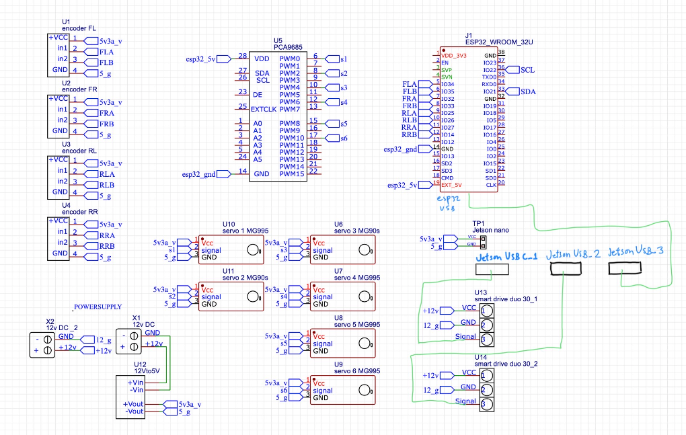

โปรเจคนี้เป็นโปรเจคที่ผมตั้งใจทำขึ้นมาหลังจากที่ผมได้ดูหนังหุ่นยนต์และเห็นบริษัทที่ทำหุ่นยนต์เจ๋งๆ เช่น รีลสตีล,Cyberpunk:Edgerunners,guardians of the galaxy,Boston dinamic, tesla, nasa และอีกหลายๆเรื่องและหลายๆบริษัท ผมจึงอยากสร้างหุ่นยนต์ของตัวเองดูครับ\
today im starting with my new robot project (next gen of kalwtummad2). but these code is just a small path of this project (updating the code continuously)\
3d : <https://collaborate.shapr3d.com/v/ItvfXJBg52ye7wI7pF4OV>\
arm 3d: <https://collaborate.shapr3d.com/v/P_J-J_7XLpJSV6bIwB8kV>

# Components in this projec
- Jetson nano developer kit
- Smart drive duo 30
- Raspberry pi camera
- Motor 12V DC
- Encoder 330 ppr
- RPLiDAR S1
- esp32
- mg995
- mg90s
- dss m15
- pca9685

# assembly sketch concept

# controlling smartdriveduo30 motor driver
this represent how to control smartdrive duo 30 using ros2 on jetson nano.
the concept to control smartdrive duo 30 is:

- 00000000 - 00111111 (0-63) is left wheel go forward
- 01000000 - 01111111 (64-127) is left wheel go backward
- 10000000 - 10111111 (128-191) is right wheel go forward
- 11000000 - 11111111 (192-255) is right wheel go backward

# controlling encoder 330 ppr(pulse per round)
this represent how encoder 330 work!
on encoder they have 2 signals call A signal and B signal

# problems in this project
1. arm problem : servo ร้อนและแรงตก ต้องคำนวน spec ใหม่

-------------
บอลหนัก 298g 

(มีอัพเดทโค้ดเรื่อยๆนะครับ)
